# ZelloWork client SDK for Windows
*Push-to-talk SDK for your Windows or Windows Mobile application*

Version: 2.19<br>
Date: May 31, 2018

### Introduction
Thanks for downloading ZelloWork SDK. It’s designed to enable easy integration of push-to-talk function into any application. This document will guide you through the installation and use of the SDK.
### Technology
ZelloWork SDK provides ActiveX wrapper exposing the required set of Zello client functions. It’s designed to work with Zello Enterprise server or with ZelloWork managed service.  
### Installation
You need a Windows PC to use the SDK. To install the SDK launch the [ZelloWorkClientSDKSetup.exe](https://github.com/zelloptt/zellowork-windows-client-sdk/blob/master/ZelloWorkClientSDKSetup.exe?raw=true) and follow the installation wizard:


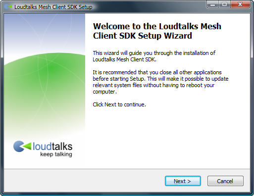


The SDK installs samples, documentation and registers ActiveX control (ptt.dll). Once installed you can access SDK items from Start menu.
 
##Samples overview
Before digging into the code you can try the compiled samples, which are located in ‘Samples\bin’ subfolder of the SDK.

###Sample1.exe 
*Win32 C++ application for Windows using ActiveX control*

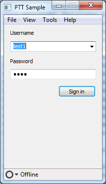
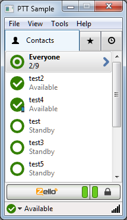

###Sample2.htm 
embedding Zello ActiveX control into a web-page. Use Internet Explorer to view this sample. 

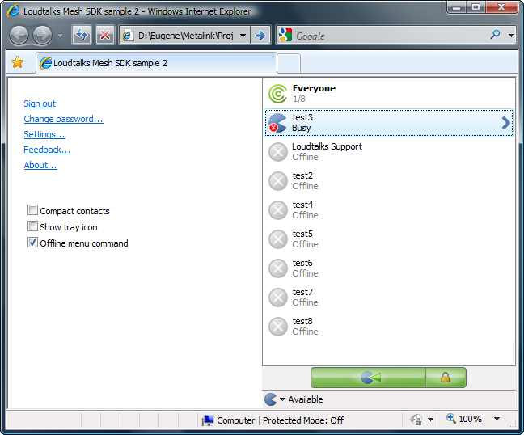

###Sample3.exe 
.NET application for Windows using ActiveX control

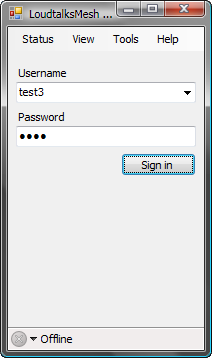
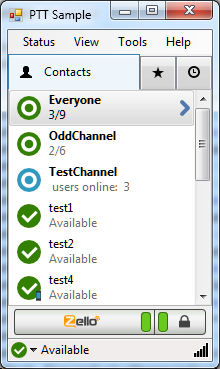

###Sample4.exe
Win32 C++ application for Windows Mobile. This one is a bit tricky. To test it you have to copy the file and ptt.dll from ‘mobile’ subfolder to the mobile device and register ptt.dll there using regsvrce.exe utility.

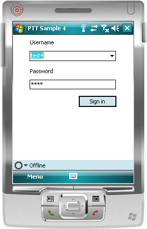
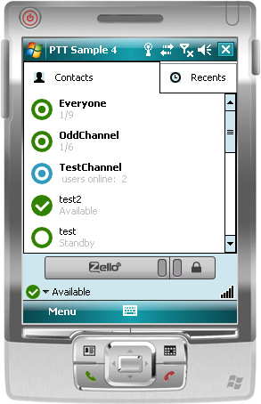

###Sample5.exe
Win32 C++ application for Windows implementing custom GUI

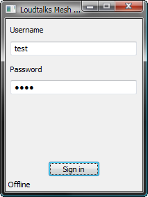
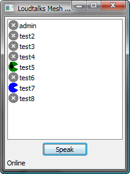

###Sample6.exe 
.NET 2.0 C# application for Windows Mobile

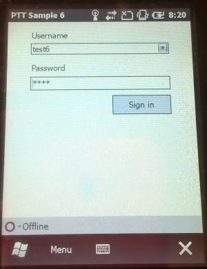
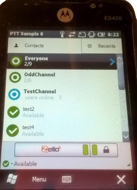

###Sample7.exe 
Visual Basic 6 application for Windows using ActiveX control

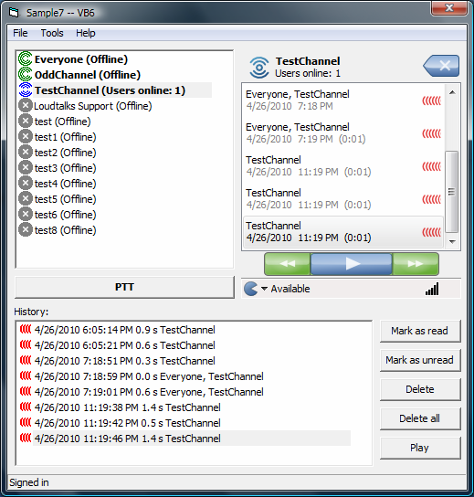

###SoundSample.exe 
.NET 2.0 C# application implementing audio integration interfaces.
If integration mode is active, ActiveX control doesn't use playback and rendering hardware audio devices.
Instead host app receives uncompressed PCM audio stream for each incoming message, and provides custom PCM audio stream for each outgoing message.
If chorus mode is active, all incoming audio messages are activated concurrently on receive, while in normal mode they are activate sequentially, one by one, similar to how Zello client normally works.

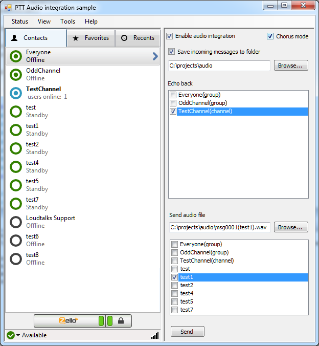

###Sample8.exe
Win32 C++ application for Windows based on headless SDK, implementing custom GUI 


###MultiClientSample
.NET 2.0 C# application based on headless SDK, implementing audio integration interfaces.
Main window allows to create several in-proc zello clients, each one having functionality similar to SoundSample
If integration mode is active, Zello client doesn't use playback and rendering hardware audio devices.
Instead host app receives uncompressed PCM audio stream for each incoming message, and provides custom PCM audio stream for each outgoing message.

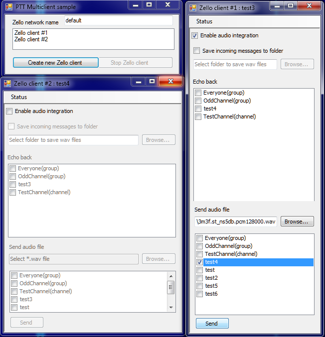

The samples are compiled for the use with ‘default.zellowork.com’ Zello for Work network. You can use any of the following login / password pairs to sign in:

```
test / test
test2 / test
test3 / test
test4 / test
test5 / test
test6 / test
test7 / test
test8 / test
```
Please note that this network / usernames is intended for quick test only. For your development you’ll need to register your own free Zello for Work network.

##Exploring the code

Follow these steps to start developing with Zello for Work SDK.

###Step 1. Register your development network

1.	Go to [zellowork.com](https://zellowork.com/) enter desired network name, your full name and a valid e-mail address.
2.	An e-mail will be sent to you with the new network admin password
3.	Log-in to the newly created network web console and add some test users. You can create up to 5  users for your testing.

###Step 2. Open relevant sample and modify the code to use your network

1.	Sample 2 uses HTML and JavaScript only so it could viewed and edited in any text editor
a.	All other samples require Visual Studio 2008 or later
2.	In the code replace network name ‘default’ with the name of the network you just registered
3.	Compile and run the sample
4.	Verify that you can login using the accounts you created
5.	Test push-to-talk functionality

###Step 3. Check out documentation

1.	Explore [ZelloWork.chm](ZelloWork.chm) installed with the SDK or [online reference](https://zelloptt.github.io/zellowork-windows-client-sdk/) to see the interfaces available to your application
2.	Contact us if you have any questions or can’t find the API method you need

##Deploying your application
When deploying your application make sure that the following conditions are met:

1.	You application installer installs and registers ptt.dll ActiveX control
2.	Make sure that you use the appropriate ActiveX control for your target platform. 
  a.	ptt.dll located in the SDK root folder is intended for Windows
  b.	ptt.dll located in the ‘mobile’ subfolder is intended for Windows Mobile

## Going live with your Zello-enabled app
All apps using Zello SDK must adhere to the following guidelines:

* All UI screens, embedding Zello SDK must include Zello logo
* Use Zello logo and / or "Zello", "ZelloWork" names, when referencing to Zello inside of your app
* [Send us the app for review](https://zellowork.com/contact/) before distributing the app to any third parties or customers

##Additional resources
For more information visit our website at [zellowork.com](https://zellowork.com) or send an e-mail to [support@zello.com](mailto:support@zello.com) 
